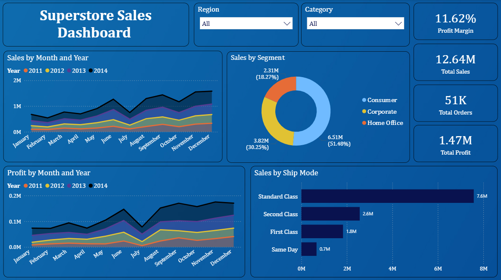
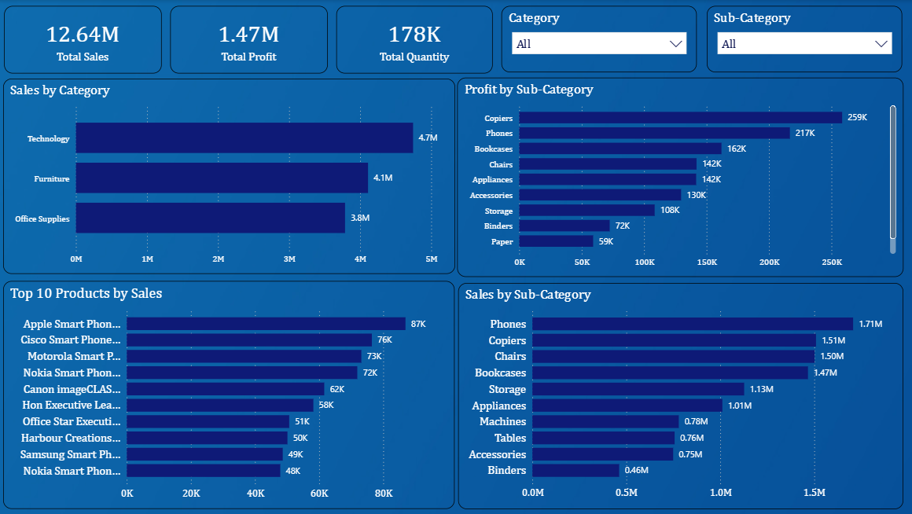
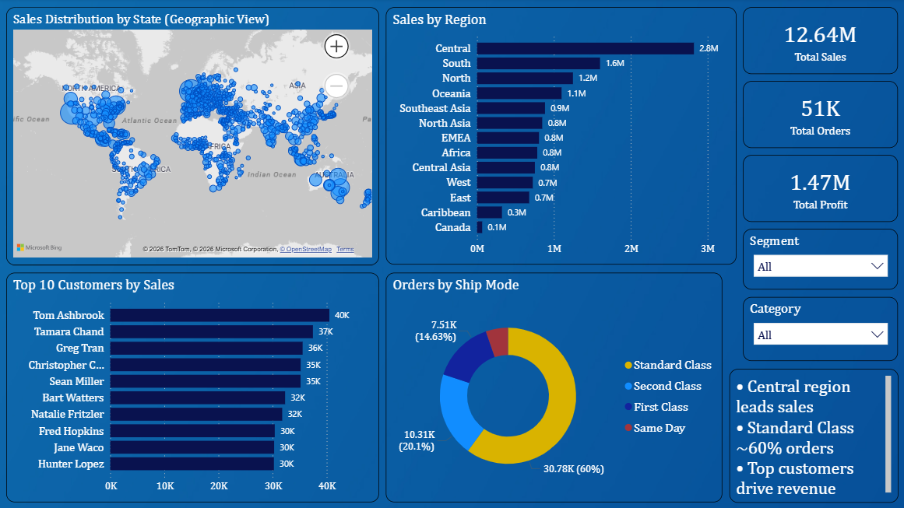

# 📊 Superstore Sales Dashboard

## 📌 Project Overview

An interactive Power BI dashboard developed to analyze sales, profit, customer segments, and regional performance using the Superstore dataset.
The dashboard helps identify key business insights and supports data-driven decision making.

---

## 🚀 Features

* Sales & Profit trend analysis
* Category and Sub-category performance
* Top Customers and Top Products
* Regional sales distribution
* Shipping mode analysis

---

## 📊 Dashboard Screenshots

### 🔹 Overview

This project demonstrates the ability to transform raw data into actionable business insights using Power BI.

### 🔹 Product Analysis

### 🔹 Customer & Regional Insights

---

## 📁 Project Files

* 📊 [Power BI Dashboard](./Superstore_Sales_Dashboard.pbit)
* 📄 [Dataset](./SuperStoreOrders.xlsx)
* 🖼️ [Screenshots](./Screenshots/)

---

## 📁 Dataset

* Superstore Orders dataset used for analysis.

---

## 🛠️ Tools & Technologies

* Power BI
* Microsoft Excel

---

## 📈 Key Insights

* Central region has the highest sales contribution
* Standard Class shipping is most frequently used
* Technology category generates maximum revenue
* A few top customers contribute significantly to total sales

---

## 📌 How to Run

1. Download the [Power BI Dashboard](./Superstore_Sales_Dashboard.pbit)
2. Open it in Power BI Desktop
3. Load the dataset when prompted

---

## 💡 Skills Demonstrated

* Data Visualization
* Business Analysis
* Dashboard Development

---

## 👩‍💻 Author

**Nikita Gaikwad** 
[GitHub](https://github.com/nikitagaikwad0111)
